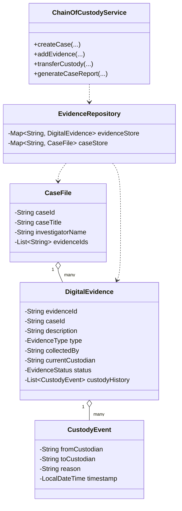
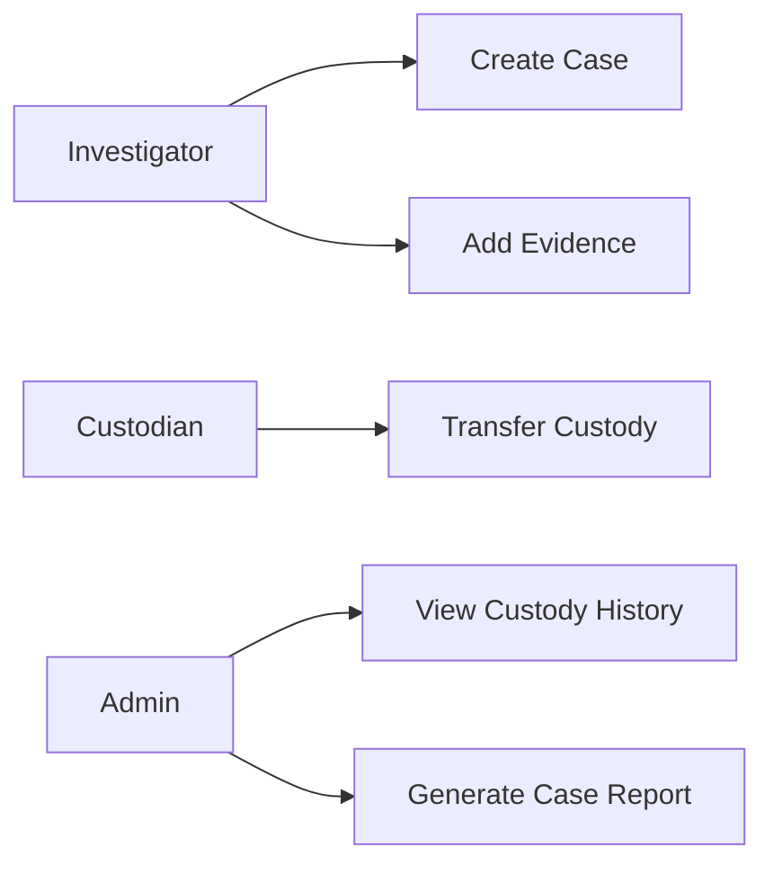
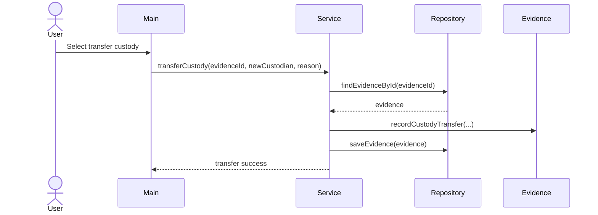

# Digital Evidence & Case Chain-of-Custody Management System

## Project Overview
This is a Java OOAD mini-project for managing digital evidence and maintaining a chain of custody across a case lifecycle.

## Goals
- Register digital evidence for a case
- Track evidence custody transfers with timestamps and reasons
- Maintain an auditable custody history
- Generate a case-wise evidence report

## Technology Stack
- Java 17
- Maven
- Console-based application
- Java HTTP server for the browser frontend
- File-based persistence for stored cases and evidence
- Spring Boot MVC web application with Thymeleaf
- MongoDB persistence via Spring Data MongoDB

## OOAD Summary

### Actors
- Investigator
- Evidence Custodian
- Administrator

### Core Use Cases
- Create case record
- Add evidence to a case
- Transfer custody of evidence
- View custody history
- Generate case report

### Class Diagram


### Use Case Diagram


### Sequence Diagram for Custody Transfer


## How to Run
1. Make sure Java 17 and Maven are installed.
2. Open a terminal in the project folder.
3. Run:
```bash
mvn -q compile exec:java
```

### Primary Demo App (Use This For Teacher Demo)
Use the Spring MVC app with database persistence and plain HTML/CSS/JavaScript frontend.

Run from project root:
```powershell
mvn -f spring-app/pom.xml spring-boot:run -Dspring-boot.run.profiles=mongo
```

Optional with environment variable:
```powershell
$env:MONGO_URI="mongodb://localhost:27017/evidence_db"
mvn -f spring-app/pom.xml spring-boot:run -Dspring-boot.run.profiles=mongo
```

Then open:
```text
http://localhost:8081/app/index.html
```

### Live Server Frontend Only (No Spring Required)
If you only want UI demo without starting Spring Boot:

1. Open `spring-app/src/main/resources/static/app/index.html` in VS Code.
2. Start **Live Server** from that file.
3. Use the UI directly.

In this mode:
- No Java process is required.
- No MongoDB is required.
- Data is stored in browser `localStorage`.

Alternative from spring-app folder:
```powershell
cd spring-app
mvn spring-boot:run -Dspring-boot.run.profiles=mongo
```

### Legacy Fallback App (Only If Maven Is Unavailable)
This is the older lightweight Java HTTP-server app.

Run it with:
```powershell
New-Item -ItemType Directory -Force out | Out-Null
$files = Get-ChildItem -Recurse -Filter *.java src\main\java | ForEach-Object { $_.FullName }
javac -d out $files
java -cp out com.digitalevidence.web.WebApplication
```

Then open:
```text
http://localhost:8080
```

### Fallback without Maven on Windows
If Maven is not available, compile and run with the JDK directly:
```powershell
New-Item -ItemType Directory -Force out | Out-Null
$files = Get-ChildItem -Recurse -Filter *.java src\main\java | ForEach-Object { $_.FullName }
javac -d out $files
java -cp out com.digitalevidence.Main
```

## Sample Functionalities
- Create a new case
- Register evidence
- Transfer evidence custody
- Print case report with full chain-of-custody history
- Starts with a seeded demo case so you can show the workflow immediately
- Browser frontend with cards, forms, and live case report
- Data persists between runs in `data/evidence-store.ser`
- Spring module also exposes API-backed HTML/CSS/JavaScript frontend

## Suggested Mini-Project Submission Format
- Title page
- Problem statement
- Objectives
- Requirements
- Use case diagram
- Class diagram
- Sequence diagram
- Java source code
- Output screenshots
- Conclusion

## Project Files
- [Full report](docs/PROJECT_REPORT.md)
- [Presentation outline](docs/PRESENTATION_OUTLINE.md)
- [Sample output](docs/SAMPLE_OUTPUT.md)
- [PDF guideline compliance map](docs/PDF_GUIDELINE_COMPLIANCE.md)
- [Submission blueprint](docs/SUBMISSION_BLUEPRINT.md)
- [Demo quickstart](docs/DEMO_QUICKSTART.md)

## What You Are Supposed To Submit (As Per Guideline)
1. Phase 1 specification with clear functional requirements
2. Phase 2 report with Use Case, Class, Activity, and State diagrams
3. MVC architecture description
4. 4 design principles and 4 design patterns with mapping
5. Public GitHub repository link
6. Individual contribution details for 4 members
7. White-background screenshots showing input and output

Use this quick checklist document:
- [Submission blueprint](docs/SUBMISSION_BLUEPRINT.md)
