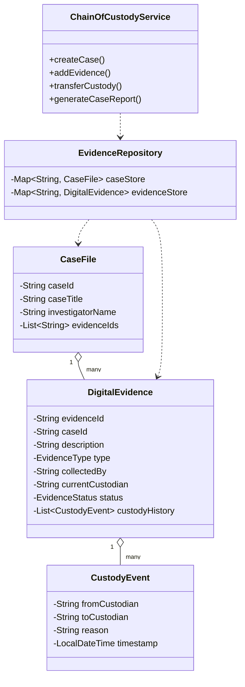
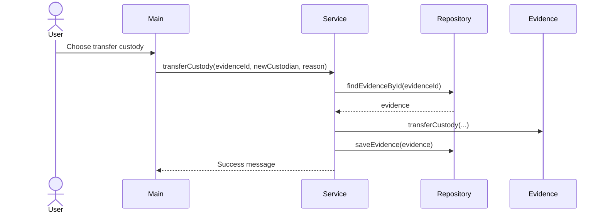
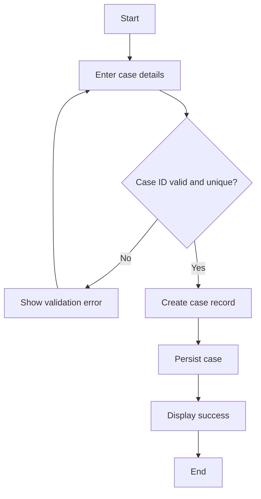
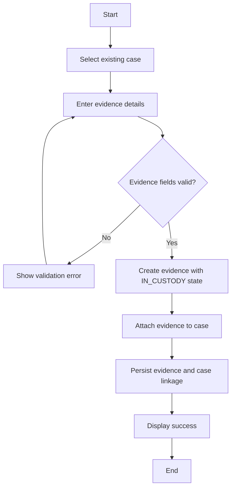
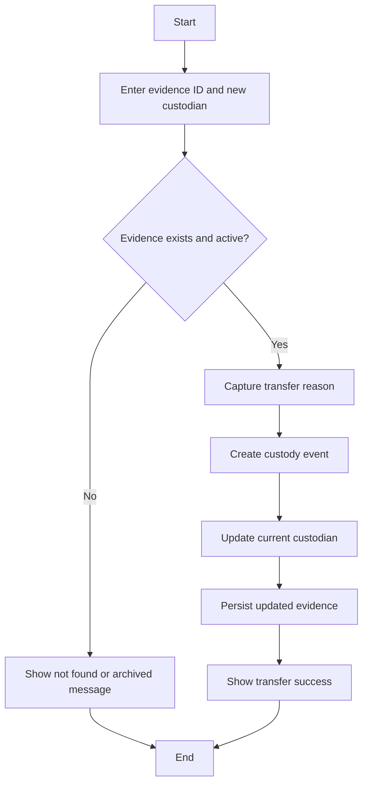
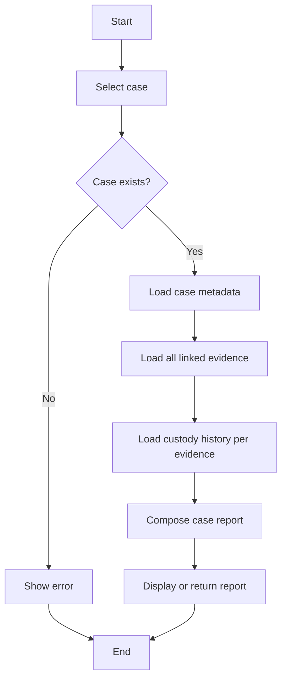
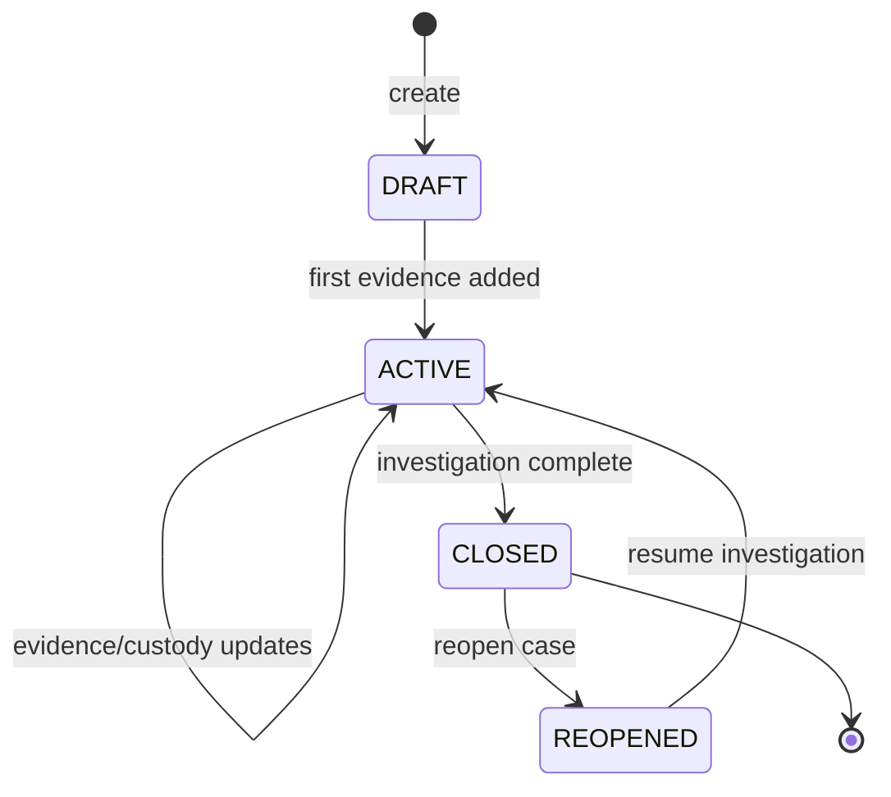
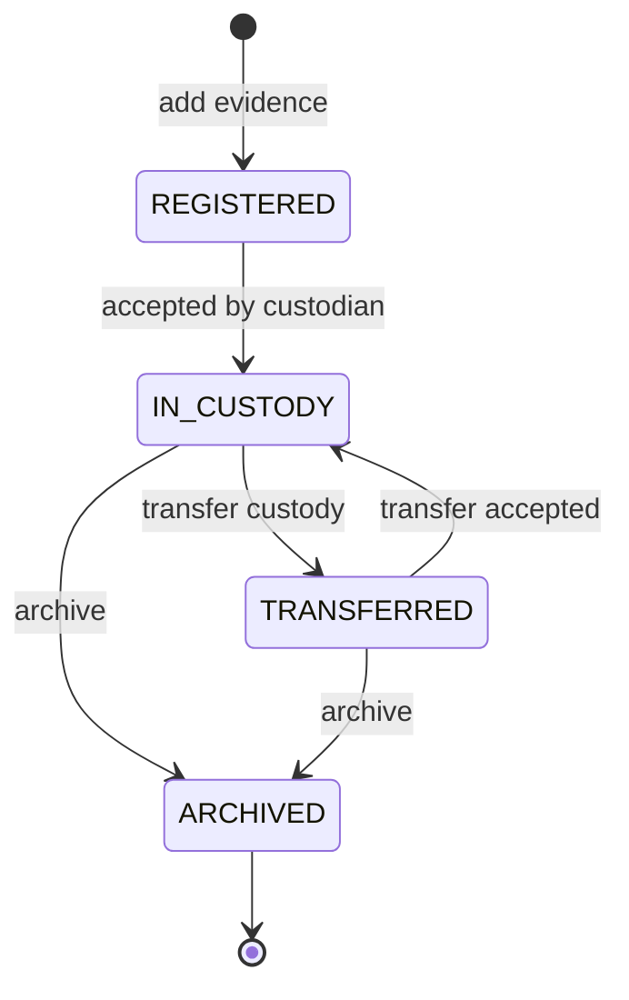
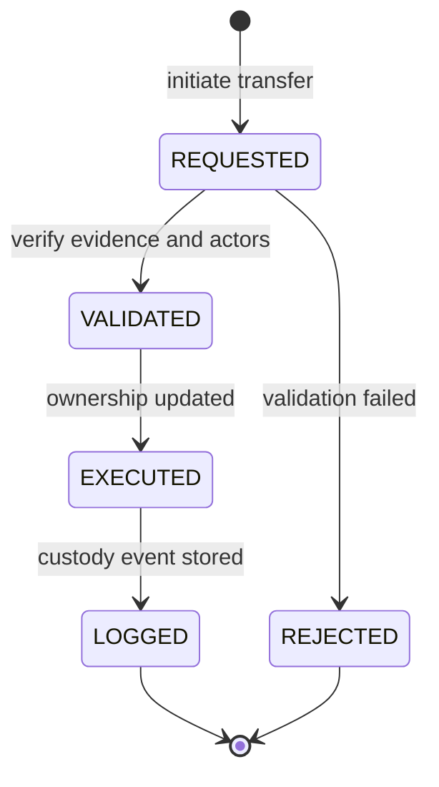
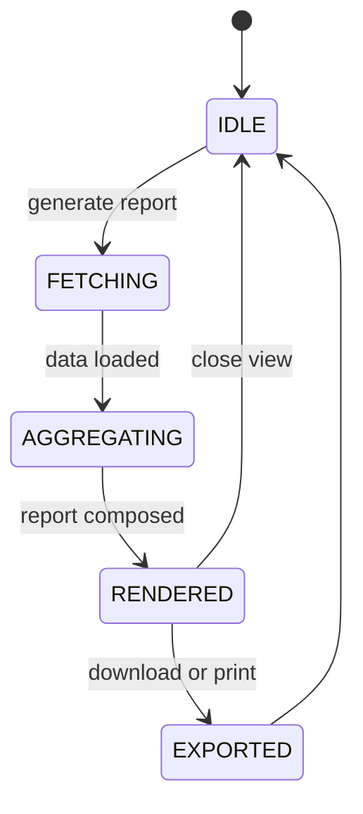

# Digital Evidence & Case Chain-of-Custody Management System

## 1. Introduction
Digital evidence is highly sensitive because its value depends on integrity, authenticity, and traceability. In real investigations, every movement of an evidence item must be recorded so that the evidence remains legally defensible. This mini-project models a chain-of-custody management system that tracks digital evidence across a case lifecycle.

## 2. Problem Statement
Manual evidence tracking is error-prone and difficult to audit. Missing transfer details, unclear custody ownership, and weak history logs can compromise an investigation. A structured digital system is needed to register evidence, track custody, and generate case-wise audit reports.

## 3. Objectives
- Register cases and digital evidence in a structured way.
- Maintain custody history for every evidence item.
- Record who collected, transferred, and currently holds evidence.
- Generate an audit-friendly case report.
- Provide a simple Java-based implementation for demo and submission.

## 3.1 Phase Planning (As Per Course Guideline)
- Phase 1 (Mini-project specification): finalized problem statement, domain scope, actors, and functional requirements.
- Phase 2 (Analysis, Design, Implementation): completed UML models, MVC architecture implementation, database persistence, and integrated demo.

## 4. Scope
The project includes two implementations:
- Core Java implementation (console + lightweight web server) for easy demonstration.
- Spring MVC + MongoDB database implementation in `spring-app` for guideline-compliant architecture.

It includes case creation, evidence registration, custody transfer, evidence search, evidence archive, history tracking, and reporting.

## 5. Users / Actors
- Investigator: creates cases and registers evidence.
- Evidence Custodian: receives and transfers custody.
- Administrator: reviews reports and case history.

## 6. Functional Requirements
- Create a case record.
- Add evidence to a case.
- Transfer custody of evidence.
- View full chain-of-custody history.
- Generate a case report.
- List all stored cases.
- Search evidence by ID.
- Archive evidence item.

## 7. Non-Functional Requirements
- Integrity: custody history must not be lost during runtime.
- Usability: menu-driven console interface.
- Reliability: invalid inputs should be rejected with clear messages.
- Maintainability: clean separation of model, repository, and service layers.
- Portability: runs on any system with Java 17.
- Scalability: Spring MVC module supports database-backed growth.

## 8. OOAD Analysis

### 8.1 Use Cases
- UC1: Create Case
- UC2: Add Evidence
- UC3: Transfer Custody
- UC4: View Custody History
- UC5: Generate Report
- UC6: Search Evidence
- UC7: Archive Evidence
- UC8: View Selected Case Dashboard

Major Use Cases (4): UC1, UC2, UC3, UC5

Minor Use Cases (4): UC4, UC6, UC7, UC8

### 8.2 Class Model

### 8.3 Sequence of Custody Transfer

### 8.4 Activity Diagram 1 (Create Case - UC1)

### 8.5 Activity Diagram 2 (Add Evidence - UC2)

### 8.6 Activity Diagram 3 (Transfer Custody - UC3)

### 8.7 Activity Diagram 4 (Generate Report - UC5)

### 8.8 State Diagram 1 (Case Lifecycle)

### 8.9 State Diagram 2 (Evidence Lifecycle)

### 8.10 State Diagram 3 (Custody Transfer Request)

### 8.11 State Diagram 4 (Report Generation Lifecycle)

## 9. Design Principles, and Design Patterns:

### MVC Architecture used? Yes/No

Yes

The system is developed using the Model-View-Controller (MVC) architecture provided by Spring Boot.

- Model: Represents data (CaseFileEntity, EvidenceEntity, CustodyEventEntity)
- View: Frontend UI (Thymeleaf dashboard and static app pages)
- Controller: Handles requests, processes logic, and connects Model & View

This separation improves maintainability, scalability, and code organization.

## Design Principles

1. Single Responsibility Principle (SRP)

Each class has a single responsibility.
Example:

- WebDashboardController handles web page requests
- ApiController handles JSON API requests

This makes the system easier to maintain and debug.

2. Open/Closed Principle (OCP)

The system is open for extension but closed for modification.
Example:

- New features such as additional reports or search filters can be added without changing existing code

3. Separation of Concerns (SoC)

Different functionalities are separated into layers:

- Controller -> Request handling
- Service -> Business logic
- Repository -> Database interaction

This improves clarity and modularity.

4. DRY (Don’t Repeat Yourself)

Reusable methods are used instead of duplicating code.

## Design Patterns

1. MVC Pattern

The project follows the Model-View-Controller pattern for separating data, UI, and request handling.

2. Repository Pattern

Spring Data repositories isolate database operations from the service layer.

3. Service Layer Pattern

Business rules are centralized in `EvidenceManagementService`.

4. DTO Pattern

Request and response DTOs are used to keep API contracts separate from entity models.

5. Dependency Injection

Spring injects repositories and services into controllers and service classes, reducing coupling.

## 10. Modules in the Java Project
- Main: console menu and demo data.
- model: case, evidence, and custody entities.
- repository: in-memory storage layer.
- service: business logic and report generation.
- exception: validation error handling.
- spring-app: guideline-compliant MVC + database implementation.

## 11. Test / Demo Scenario
1. Create a case.
2. Add evidence items.
3. Transfer custody of one evidence item.
4. Search evidence by ID.
5. Archive evidence item.
6. Generate the report.
7. Verify custody history and status transitions.

## 12. Sample Output
See [SAMPLE_OUTPUT.md](SAMPLE_OUTPUT.md).

## 13. Individual Contribution Template
1. Member 1
- Major: Create Case (UC1)
- Minor: List/View Cases (UC8)
- Principles/Patterns Ownership: SRP + MVC Controller flow

2. Member 2
- Major: Add Evidence (UC2)
- Minor: Search Evidence (UC6)
- Principles/Patterns Ownership: OCP + Factory Method

3. Member 3
- Major: Transfer Custody (UC3)
- Minor: Archive Evidence (UC7)
- Principles/Patterns Ownership: DIP + Strategy extension point

4. Member 4
- Major: Generate Report (UC5)
- Minor: View Custody History (UC4)
- Principles/Patterns Ownership: ISP + DTO/Adapter mapping

## 14. Future Enhancements
- Add role-based authentication for Investigator/Custodian/Admin.
- Store evidence hash values for tamper detection.
- Add PDF report export and signed audit logs.
- Integrate notification workflows for custody transfers.

## 15. Conclusion
The project demonstrates how OOAD principles can be applied to a real-world digital evidence scenario. The system separates responsibilities into models, service logic, and storage, while preserving chain-of-custody tracking in a simple Java implementation.
